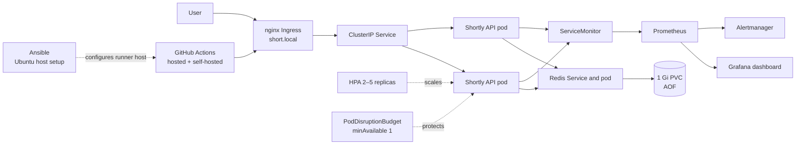
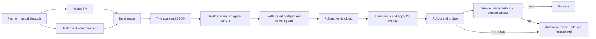

# Shortly DevOps: reflection and evidence report

## 1. Summary

Shortly is a FastAPI URL shortener whose shared link state and counters live in Redis. [README.md](../README.md)
The service runs as multiple pods on a local Minikube profile, behind nginx Ingress, with readiness/liveness probes and a horizontal pod autoscaler. [docs/k8s.md](k8s.md)
Prometheus, Grafana, Alertmanager and Locust make latency, errors, scaling and failure scenarios observable. [docs/monitoring.md](monitoring.md), [docs/scenarios.md](scenarios.md)
GitHub Actions runs hosted quality and image checks, then a guarded self-hosted deployment job verifies the scanned image digest. [docs/cicd.md](cicd.md)
The saved scenario suite records eight PASS results and one initial FAIL; a focused rerun later passed the abuse scenario, but the complete suite was not rerun. [loadtest/reports/SUMMARY.md](../loadtest/reports/SUMMARY.md)
On Ubuntu 24.04, the Ansible container evidence shows a first apply with 31 changes, then an idempotent apply and read-only verify with zero changes. [ansible/evidence/container-first-run.txt](../ansible/evidence/container-first-run.txt), [ansible/evidence/container-idempotence.txt](../ansible/evidence/container-idempotence.txt)
The bonus challenge remains pending because no Step 6 proof file was found. [docs/bonus/README.md](bonus/README.md)

## 2. Architecture



| Component | Role | Reason |
|---|---|---|
| FastAPI Shortly pods | Create links, redirect, expose health and metrics | Stateless replicas can share traffic while state stays in Redis. |
| Redis + AOF PVC | Links, click counts, rate limits, recent links and chaos configuration | Shared state survives app-pod replacement; the demo uses a single Redis replica. |
| Ingress and Service | Route `short.local` to ready app pods | Provides one HTTP entry point and supports forwarded client IP in the local trusted ingress. |
| HPA, PDB and probes | Scale from 2 to 5, protect one available pod, separate liveness from readiness | Show scaling and zero-unavailable rolling behavior on Minikube. |
| Prometheus, Grafana, Alertmanager | Scrape app and Kubernetes metrics, show dashboard and evaluate six app alerts | Makes failure modes visible; demo Alertmanager uses a null receiver. |
| GitHub Actions and Ansible | Scan/build/deploy exact image; configure a Debian/Ubuntu runner host | Automates release checks and host setup while keeping cluster credentials on the runner. |

The app stores no link state in local pod memory. `/healthz` checks process liveness while `/readyz` also requires Redis; the deployment uses `maxUnavailable: 0`, one surge pod, and a PDB with `minAvailable: 1`. Redis uses a single Recreate Deployment, AOF and a 1 Gi PVC. These are local-demo decisions, not a high-availability topology. See [Kubernetes setup](k8s.md) and [monitoring](monitoring.md).

## 3. Pipeline flow



| Stage | Tool | What it blocks |
|---|---|---|
| Lint | Ruff, Hadolint, kubeconform, actionlint | Python formatting/lint, unsafe Dockerfile rules, invalid manifest schema, workflow errors. |
| Test | pytest with coverage threshold | Test failures or coverage below 90%. |
| Build and scan | Buildx, Trivy, CycloneDX | Fixed CRITICAL image vulnerabilities and repository secrets; HIGH findings are reported. |
| Push | Docker and GHCR | Registry authentication or image push failure. |
| Preflight/deploy | Docker, kubectl and Minikube | Wrong/stopped cluster, missing prerequisites, digest mismatch, rollout or probe failure. |
| Verify | curl, smoke and Locust | Wrong version, application failure, failed smoke/load smoke, or rollout probe failure. |

The runbook estimates a typical complete pipeline at **7–15 minutes**; this is the documented estimate, not an independently measured `gh run list` sample. Deployment verifies the registry digest, checks the kubectl context, loads the matching image into Minikube, applies a temporary CI overlay, waits for the rollout and checks requests/version. A failed deploy or verification invokes one rollback helper; a successful undo still leaves the release job failed. PR events do not deploy to the self-hosted runner. Details: [docs/cicd.md](cicd.md).

## 4. Assignment steps 1–6

| Step | Requirement quoted from the supplied assignment | What was built | Files | Evidence filenames | Key result |
|---|---|---|---|---|---|
| 1 | “workflow file and pipeline diagram” | Hosted lint/test/build/scan/push and guarded self-hosted deploy/rollback workflow with a pipeline diagram. | `.github/workflows/ci-cd.yml`, `.github/workflows/rollback.yml`, `docs/diagrams/pipeline.mmd`, `scripts/ci/` | `10-pipeline-green.png`, `11-pipeline-autorollback.png`, `27-pipeline-diagram.png` | Workflow and local deployment tooling are committed; GitHub captures remain pending. |
| 2 | “playbook/manifest and inventory” | Ansible site and verification playbooks, role-based host setup and local/remote inventory examples. | `ansible/site.yml`, `ansible/verify.yml`, `ansible/inventory/`, `ansible/roles/` | `21-ansible-check-diff.png` through `24-ansible-verify-pass.png` | Ubuntu 24.04 first apply: changed=31; second apply and verify: changed=0; macOS host correctly refused before changes. |
| 3 | “Dockerfile and Kubernetes YAMLs plus screenshots of rolling update and rollback” | Multi-stage Docker image, Minikube manifests, HPA, PDB, probes, Ingress, Redis PVC and rollout scripts. | `Dockerfile`, `k8s/`, `scripts/probe.sh`, `scripts/smoke.sh` | `16-kubectl-pods.png`, `17-rolling-update-probe.png`, `18-rollback-history.png` | Saved good-release report observed v1 and v2, then v2 only, with 0 unexpected failures. |
| 4 | “Prometheus/Grafana dashboard screenshots (uptime, latency, error rate)” | ServiceMonitor, six alert rules, provisioned dashboard, stack configuration and nine Locust scenarios. | `monitoring/`, `docs/monitoring.md`, `loadtest/`, `loadtest/reports/` | `19-grafana-dashboard.png`, `20-alert-firing.png`, plus scenario shots 01–09 | Saved tests show latency and error alerts, Redis outage and scaling; initial full suite had one abuse failure, then focused abuse rerun passed. |
| 5 | “Reflection & Report (1.5 marks): 4 to 5 slides: Architecture, pipeline flow, challenges, lessons learned. Documentation (Architecture, pipeline flow, challenges, lessons learned).” | This report, evidence-backed challenge log, five-slide deck, VIVA preparation and marker guide. | `docs/REPORT.md`, `docs/CHALLENGES.md`, `docs/VIVA.md`, `report/` | Slide slots are declared in `docs/screenshots/MANIFEST.md` | Five slides are built from repository evidence; missing screenshots stay marked pending. |
| 6 | “external DevOps challenge proof” | Not evidenced in the repo; stub added for later proof. | `docs/bonus/README.md` | `docs/bonus/proof-*.png` (to add) | **PENDING**. Choose a challenge, attach its original proof, and fill the five-line record. |

## 5. Testing and failure scenarios

The load test has four personas: CasualVisitor (60%, 1–4 s), Creator (25%, 3–8 s), PowerUser (10%, 2–6 s), and Abuser (5%, 0.5–3 s). The shared Abuser address is `198.51.100.250`; each ordinary user keeps a stable public test IP. Expected 4xx outcomes are recorded under named request intents and do not count as Locust failures. See [docs/scenarios.md](scenarios.md).

| Scenario | Saved outcome | Real result | Alert timing / lesson |
|---|---|---|---|
| baseline | PASS | 3,753 requests; 0 unexpected failures; p95 8 ms; 62 client IPs observed | No alert wait; baseline mixes personas successfully. |
| abuse | Initial full-suite FAIL; focused rerun PASS | Focused rerun: 6,309 requests, 0 unexpected failures, rate-limited counter +3,796, blocked +4 | No error alert; counters must aggregate across all app pods. The suite was not rerun in full. |
| latency | PASS | Fault p95 811.1 ms; recovered p95 8 ms; 0 unexpected failures | `ShortlyHighLatencyP95` fired at 76.0 s. |
| errors | PASS | Locust 25.04%, Prometheus 25.07%; recovered with 0 failures | Error alert fired at 131.5 s and resolved at 242.7 s. |
| redis-down | PASS | `/readyz` 503; app restart count stayed 0; saved link redirected after recovery | Redis alert fired at 40.6 s; pods-not-ready at 86.1 s. |
| good-release | PASS | v1 and v2 seen during rollout, only v2 at end; 1,264 requests and 0 failures | Rollout completed in 16 s. |
| bad-release-errors | PASS | New pods Ready; fault ratio 24.38%; rollback restored v1 | Error alert fired at 130.8 s; readiness alone missed the broken behavior. |
| bad-release-crash | PASS | CrashLoopBackOff observed; rollback restored v1; 7,354 requests and 0 failures | Crash-loop alert fired at 90.2 s. |
| surge | PASS | HPA max 3 replicas then returned to 2; 24,874 requests and 0 failures | Scaled above the baseline without an error alert. |

The full run lasted 55.7 minutes on 2026-09-30 and logged eight PASS plus one FAIL. The 2026-09-30 focused abuse rerun passed in 225.6 seconds. The final smoke verification recorded in `loadtest/reports/SUMMARY.md` passed all 11 checks using the ingress port-forward. These are saved outputs, not a claim that the scenarios were rerun while preparing this report.

## 6. Challenges

| # | Challenge | Resolution | Evidence |
|---:|---|---|---|
| 1 | A bad release stayed Ready while serving errors | Use request/error alerts plus rollout verification and rollback. | [Challenge 1](CHALLENGES.md#1--ready-pods-can-still-serve-a-broken-release) |
| 2 | Kustomize restricted a nested parent reference | Generate a temporary sibling overlay and apply one rendered manifest set. | [Challenge 2](CHALLENGES.md#2--the-nested-ci-overlay-could-not-use-the-parent-kustomize-base) |
| 3 | Grafana was OOM-killed at lower memory limits | Raise the limit to 512 MiB based on the observed chart behavior. | [Challenge 3](CHALLENGES.md#3--grafana-was-oom-killed-at-lower-memory-limits) |
| 4 | Redis outage affected readiness and requests | Keep liveness independent; verify no app restart and link recovery. | [Challenge 4](CHALLENGES.md#4--redis-outage-should-remove-readiness-without-restarting-app-pods) |
| 5 | Ansible host did not match supported OS | Stop safely on macOS and prove the positive path on Ubuntu 24.04. | [Challenge 5](CHALLENGES.md#5--the-laptops-ansible-target-was-unsupported) |

See the [full challenge log](CHALLENGES.md) for symptoms, root causes, source evidence, lessons and confidence. Challenge 9 requires confirmation before presentation.

## 7. Lessons learned, limitations and future work

- **Challenge 1:** a ready probe is not proof of correct user requests; pair probes with real-traffic metrics and post-rollout verification.
- **Challenge 2:** deployment tooling has filesystem constraints; generating and rendering a temporary overlay keeps the applied set explicit.
- **Challenge 3:** resource limits need observed headroom; lower Grafana settings caused OOM restarts on the pinned stack.
- **Challenge 4:** readiness should express dependency availability without needlessly restarting a healthy process; persistent Redis state needs a recovery check.
- **Challenge 5:** idempotence evidence must come from a supported, repeatable target; report the container result separately from the macOS refusal.

**Limitations.** The target is a single-node local Minikube cluster. Redis is one replica, Grafana uses a demo password, Alertmanager routes to a null receiver, there is no TLS, and chaos endpoints are demo-only. Image loading uses `minikube image load`; the self-hosted runner is a local machine and must only receive trusted deployments. These details are documented in [docs/k8s.md](k8s.md), [docs/monitoring.md](monitoring.md) and [docs/cicd.md](cicd.md).

**Future work.** Repeat the deployment and load checks on a real multi-node cloud cluster, add GitOps reconciliation, define SLO-based alert thresholds from production traffic, configure a real alert receiver, and use hardened runner isolation. Complete the optional external challenge and attach original proof before claiming Step 6.

## 8. Reproducing the project

From the repository root, with Docker running and the required CLI tools installed:

```sh
make install
make test lint
make k8s-up build-all load-all
ADMIN_TOKEN='choose-a-local-demo-token' make deploy
make smoke
make monitoring-up monitoring-status check-dashboard
make traffic DURATION=120
make load-install
make scenario-all
make ansible-install ansible-lint ansible-check ansible-apply ansible-idempotence ansible-verify
make ci-local
ALLOW_CONTEXT=shortly PROFILE=shortly make runner-check
ALLOW_CONTEXT=shortly PROFILE=shortly make ci-deploy-local VARIANT=good
```

The scenario suite takes roughly 40–50 minutes according to `docs/scenarios.md`; the saved suite summary records 55.7 minutes. Ansible's positive path requires Debian/Ubuntu; use the documented disposable Ubuntu test target where available. Self-hosted GitHub runner deployment is optional for local reproduction and should remain in the private project.

## 9. Repository map

```text
app/                 FastAPI app, routes, storage, templates and metrics
ansible/             Host playbooks, roles, inventories and run evidence
docs/                Phase runbooks, report, challenges, VIVA and screenshot plan
k8s/                 Minikube application, Redis and CI overlay manifests
loadtest/            Locust personas, scenario runner and saved result records
monitoring/           Prometheus rules, Grafana dashboard and stack values
report/              Python-PPTX deck builder and generated five-slide files
scripts/              Smoke, probe, CI, Ansible and report helper scripts
submission/           Marker guide and final hand-in checklist
tests/                Application regression and behavior tests
```
