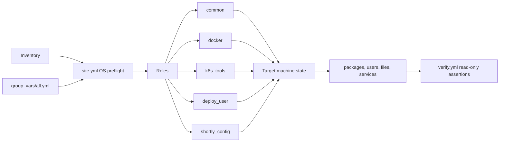

# Ansible configuration management

This phase adds an Ansible playbook for the Debian/Ubuntu runtime machine used by shortly. It installs missing packages and tools, creates a dedicated locked `deploy` account, and manages the runtime files used by the URL shortener and the Phase 5 GitHub Actions runner. Existing `docker`, `kubectl`, `helm`, and `minikube` executables are detected first and left at their current versions by default.

## Assignment mapping

| Assignment requirement | Role | Exact tasks/modules | Evidence |
|---|---|---|---|
| Install packages | `common`, `docker`, `k8s_tools` | `apt`, `apt_repository`, `get_url`, `copy`, `unarchive` | `ansible/evidence/run-1-apply.txt`, `container-first-run.txt` |
| Create users | `deploy_user` | `group`, `user`, `ansible.posix.authorized_key`, validated `template` for sudoers | `ansible/evidence/verify.txt`, `container-verify.txt` |
| Manage files | `deploy_user`, `shortly_config`, `docker` | `file`, `template`, `blockinfile`, `stat`, `slurp` | `ansible/evidence/verify.txt`, `container-facts.txt` |

## Flow



## Roles and variables

| Role | Purpose | Key modules | Key variables | Tags |
|---|---|---|---|---|
| `common` | Apt metadata, base packages, timezone, existing tool facts | `apt`, `community.general.timezone`, `shell` | `base_packages`, `timezone` | `common`, `packages` |
| `docker` | Install Docker only when missing, preserve existing daemon settings | `package_facts`, `group`, `get_url`, `apt_repository`, `apt`, `stat`, `template`, `service` | `docker_install`, `docker_extra_users`, `docker_arch_map` | `docker`, `packages`, `files`, `users` |
| `k8s_tools` | Checksum-verified kubectl, Helm, minikube and completions | `get_url`, `copy`, `unarchive`, `shell`, `command` | `kubectl_version`, `helm_version`, `minikube_version`, `tools_enforce_versions` | `tools`, `packages`, `files` |
| `deploy_user` | Locked deploy account, directories, optional key, narrow sudoers | `group`, `user`, `file`, `template`, `blockinfile`, `ansible.posix.authorized_key` | `deploy_user`, `deploy_uid`, `deploy_gid`, `deploy_authorized_key` | `users`, `files` |
| `shortly_config` | Environment, minikube defaults, hosts, logs, runner environment, doctor | `template`, `stat`, `blockinfile`, `command`, `debug` | `project_base`, `shortly_namespace`, `shortly_admin_token`, `manage_hosts`, `runner_dir` | `config`, `hosts`, `runner`, `files` |

| Variable | Default | Meaning |
|---|---|---|
| `timezone` | `Asia/Kolkata` | System timezone on systemd hosts |
| `base_packages` | See `ansible/group_vars/all.yml` | Base and troubleshooting apt packages |
| `docker_install` | `auto` | Install Docker only if its CLI is missing; accepts `true` or `false` |
| `docker_extra_users` | `[]` | Additional existing accounts to append to `docker` |
| `kubectl_version` | `v1.36.5` | Exact upstream kubectl release |
| `helm_version` | `v4.2.2` | Exact upstream Helm release |
| `minikube_version` | `v1.39.0` | Exact upstream minikube release |
| `tools_enforce_versions` | `false` | Replace tools with the pinned versions when explicitly enabled |
| `deploy_uid`, `deploy_gid` | `2001` | Fixed numeric identity for the `deploy` account and group |
| `deploy_authorized_key` | empty | Optional SSH public key; empty means no key task runs |
| `project_base` | `http://short.local` | Base URL consumed by the doctor helper |
| `shortly_namespace` | `urlshortener` | Kubernetes namespace exported to deploy shell and env file |
| `shortly_image` | `shortly` | Image name for the env file |
| `registry` | `ghcr.io/kkbot122/devops-ca2` | Registry path for the env file |
| `minikube_cpus`, `minikube_memory` | `4`, `6144` | Deploy account's minikube defaults |
| `shortly_admin_token` | `demo-admin-token` | Demo-only token; override through Ansible Vault |
| `short_local_ip` | `auto` | Use Linux Docker minikube IP where detected, otherwise loopback |
| `manage_hosts` | `true` | Manage the marked `/etc/hosts` block |
| `runner_dir` | `/home/deploy/actions-runner` | Runner path to receive `.path` and `.env` |
| `minikube_profile` | `shortly` | Profile queried by the hosts mapping and doctor helper |

Upstream releases checked on 2026-10-02: [Kubernetes 1.36 patch releases](https://kubernetes.io/releases/1.36/), [Helm releases](https://github.com/helm/helm/releases), and [minikube releases](https://github.com/kubernetes/minikube/releases).

## Quickstart

From the repository root:

```sh
make ansible-install ansible-lint ansible-check ansible-apply ansible-idempotence ansible-verify
```

`ansible-check` always runs `--check --diff` before `ansible-apply`. It prompts for become credentials only if `sudo -n true` does not succeed. Run one role group with, for example, `make ansible-check ANSIBLE_ARGS='--tags config'` (or invoke `.venv-ansible/bin/ansible-playbook` directly with `--tags config`). Available tags are `common`, `docker`, `tools`, `users`, `config`, `hosts`, `runner`, `packages`, and `files`; list all tasks with `make ansible-tags`.

The default inventory is `ansible/inventory/hosts.ini` with `localhost ansible_connection=local`. To configure a remote Ubuntu VM, copy the commented example in `ansible/inventory/hosts.example-remote.ini` into a private inventory, set `ansible_host`, `ansible_user`, and `ansible_ssh_private_key_file`, then invoke Ansible with that inventory. The play enables `become` only for its configuration play. Keep the private key and real address out of Git.

Keep a real admin token out of version control. Encrypt a string and pass the encrypted value with an extra-vars file or a private inventory:

```sh
ansible-vault encrypt_string --ask-vault-pass --name shortly_admin_token 'replace-with-a-real-secret'
.venv-ansible/bin/ansible-playbook -i ansible/inventory/hosts.ini ansible/site.yml --ask-become-pass --ask-vault-pass
# Or use: --vault-id @prompt
```

Never commit a vault password or a real token. The committed default is intentionally demo-only. The `.env` task uses `no_log` and disables diff output.

## Idempotence and evidence

The first apply reports tasks that created state. `ansible-idempotence` reads the last `PLAY RECAP` and exits non-zero unless `changed=0` and `failed=0`. `verify.yml` uses read-only queries, `stat`, package facts, and assertions; its recap should have no changed tasks. Evidence is written under `ansible/evidence/`.

Expected evidence entries after completing the run:

| Run | Evidence file | Recap |
|---|---|---|
| Laptop check | `check.txt` | See saved preflight result |
| Apply | `run-1-apply.txt` | Record the actual `changed` count |
| Second apply | `run-2-idempotence.txt` | Must show `changed=0` |
| Verify | `verify.txt` | PASS assertions |
| Container first run | `container-first-run.txt` | Many new resources |
| Container second run | `container-idempotence.txt` | Must show `changed=0` |

## Live demo script

1. Show `ansible/inventory/hosts.ini` and `ansible/site.yml`; explain that the OS preflight runs without privilege escalation.
2. Run `make ansible-check` and point at the planned tasks and file diffs. On a supported Linux laptop with existing tools this should show mostly `ok` and `skipping`.
3. Run `make ansible-test-container`; show the blank Ubuntu first-run recap, the second-run `changed=0`, and the verify PASS output.
4. Run `make ansible-drift-demo`; show the two intentionally broken managed items, their repair, and the final `changed=0` recap.
5. Run `shortly-doctor` to show versions, daemon/profile status, context, DNS, and health result.

## Screenshot checklist

Save screenshots under `docs/screenshots/` when capturing the presentation:

- `20-ansible-check-diff.png`
- `21-ansible-first-run-recap.png`
- `22-ansible-idempotent-recap.png`
- `23-ansible-verify-pass.png`
- `24-ansible-drift-corrected.png`
- `25-ansible-container-test.png`
- `26-managed-files-listing.png`

## Troubleshooting

- **Sudo needs a password:** run the Make targets; they use `--ask-become-pass` if passwordless sudo is unavailable.
- **`ansible` not found:** run `make ansible-install` or activate `.venv-ansible`.
- **“world writable directory, ignoring ansible.cfg”:** keep the checkout in the WSL filesystem instead of `/mnt/c`, or set `ANSIBLE_CONFIG` to `ansible/ansible.cfg`.
- **Apt lock is held:** wait for `unattended-upgrades` or another apt process to finish.
- **Docker group change is not active:** log out and back in so the new group membership is applied.
- **GitHub download rate limit or checksum mismatch:** retry after the limit clears; do not bypass a checksum mismatch.
- **WSL without systemd:** service tasks skip cleanly. To enable systemd, add `[boot]` followed by `systemd=true` to `/etc/wsl.conf`, then run `wsl --shutdown` from Windows before reopening the distro.
- **WSL regenerated `/etc/hosts`:** set `generateHosts=false` under `[network]` in `/etc/wsl.conf`, or set `manage_hosts=false` and manage the mapping outside WSL.
- **Docker Desktop integration detected:** if `docker` exists but no `dockerd` package is installed under WSL, Docker installation is skipped and reported.
- **macOS or another unsupported OS:** the preflight stops before configuration. The supported target is Debian/Ubuntu, including WSL2 based on those distributions.

## Design decisions

- **Local inventory:** localhost with `ansible_connection=local` configures the machine already hosting minikube. Replacing it with a remote inventory and SSH variables extends the same roles to a VM.
- **Existing tools are skipped:** `command -v` records existing tool paths; safety takes priority over pin enforcement, so a working local tool is never replaced unless `tools_enforce_versions=true` is deliberately set.
- **Container proof:** Ubuntu 24.04 provides a disposable clean host for first-run and idempotence checks without touching the existing cluster. It has no systemd, so the service task skips; Docker packages may install but the daemon cannot start. Runner settings skip when `runner_dir` is absent.
- **Checksum downloads:** kubectl, Helm, and minikube use upstream published SHA-256 checksums before installation.
- **Secrets:** the admin token has a demo-only default; the templating task sets `no_log: true` and turns off diffs. Use `ansible-vault` for a real override.
- **Narrow sudoers:** `deploy` can only run status queries for Docker and GitHub runner systemd units, because those commands are read-only and sufficient for CI diagnosis. `visudo -cf` validates the drop-in before replacement.
- **Managed headers:** text files carry a visible ownership header so operators know Ansible owns them. JSON cannot contain a comment, so the deploy minikube JSON uses a `_managed_by_ansible` field. Docker's daemon JSON is strict JSON, so a sibling `.ansible-managed` marker records ownership without invalidating Docker configuration.
- **Separate verification:** `verify.yml` is read-only and independent from configuration. It can check state without accidentally repairing the state it is asserting.
- **Existing daemon config:** an existing `/etc/docker/daemon.json` is preserved unless it contains the role marker; this avoids silently changing a working daemon configuration. Docker service restarts only from the daemon-config handler after a managed file change.
- **macOS incompatibility:** the laptop is macOS but is outside the requested target set. The playbook intentionally fails before escalation or system changes; use the Ubuntu container or a Debian/Ubuntu VM to run the positive path.
- **Existing smoke script compatibility:** macOS ships Bash 3, which errors under `set -u` when expanding an empty array. `scripts/smoke.sh` now adds the optional host header through a wrapper, preserving behavior while working under Bash 3 and Bash 5.
- **YAML Ansible output compatibility:** current ansible-core removed the standalone `yaml` callback. `ansible.cfg` selects the built-in default callback with `result_format=yaml`, which keeps the requested YAML-style output without pinning an older collection only for a legacy callback.
