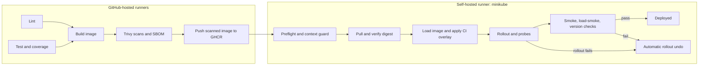

# CI/CD pipeline

## Overview

Hosted GitHub Actions run lint, tests, image security scans, and create a CycloneDX SBOM. A GHCR push is permitted only for a push to the repository or a manual dispatch. Only a `main` push or a dispatch on `main` can reach the `minikube-local` environment and self-hosted runner. The runner checks its target cluster before loading and deploying the exact image digest that passed the hosted scan.



| Stage | Tool | What it blocks | Typical duration |
|---|---|---|---:|
| Lint | Ruff, Hadolint, kubeconform, actionlint | Python format/lint, unsafe Dockerfile lint, invalid Kubernetes schema, workflow errors | 1–2 min |
| Test | pytest + coverage | Test failures or coverage below 90% | 1–2 min |
| Build and scan | Buildx, Trivy, CycloneDX | Fixed CRITICAL vulnerabilities and repository secrets; HIGH/config findings are reported | 2–5 min |
| Push | Docker/GHCR | Registry authentication or push failure | under 1 min |
| Preflight and deploy | Docker, kubectl, minikube | Wrong/stopped cluster, missing prerequisites, digest mismatch, failed rollout | 2–4 min |
| Verify | curl, smoke.sh, Locust | Wrong version, application failure, load-smoke failure, or failed rollout probes | 1–3 min |

Typical end-to-end duration is about 7–15 minutes, depending on image cache and the 20-second Locust smoke run.

## Runner setup

Use the existing private repository `kkbot122/DevOps-CA2` and a machine that can reach the local Docker daemon and minikube cluster. The workflow derives the GHCR path from `github.repository` and lowercases it through docker/metadata-action, so images will be published under `ghcr.io/kkbot122/devops-ca2`.

On Linux or macOS, install Docker, kubectl, minikube, curl, Python 3, and make. Create a runner from **Settings → Actions → Runners → New self-hosted runner**, download it, then register it with the UI-provided one-time token and the `minikube` label:

```sh
./config.sh --url https://github.com/kkbot122/DevOps-CA2 --token ONE_TIME_TOKEN --labels minikube
./run.sh
```

For Linux/macOS service mode, configure then start the generated service (`sudo ./svc.sh install` and `sudo ./svc.sh start` on Linux; follow the runner's generated instructions on macOS). Interactive `./run.sh` is useful for first setup and troubleshooting, but the terminal must remain open. On Windows, run the runner inside WSL. Service mode requires systemd enabled in WSL; without systemd, configure the runner and keep `./run.sh` running interactively.

Service environments often have a shorter `PATH` than an interactive shell. Add the directories containing `docker`, `kubectl`, and `minikube` to the runner's `.path` or `.env` file and restart the service. The runner user must have access to Docker (Linux: membership in the `docker` group, followed by a new login). The preflight guard expects the `minikube` context/profile by default. This machine's existing cluster uses context/profile `shortly`; set `ALLOW_CONTEXT=shortly` and `PROFILE=shortly` in the runner service environment, then restart the service. Keep the default if you prepare a cluster named `minikube` instead.

Map `short.local` to the ingress address as described in [Kubernetes setup](k8s.md). If name resolution fails, preflight starts a background port-forward to the ingress controller at `localhost:18000`, adds `Host: short.local`, and exports `BASE` and `HOST_HEADER` to later workflow steps. Forwarding to the app Service directly pins a single pod, which cannot observe all versions during a rollout.

Prepare the cluster and Phase 2/3 stack before using the runner:

```sh
make PROFILE=shortly k8s-up build-all load-all deploy monitoring-up
ALLOW_CONTEXT=shortly PROFILE=shortly make runner-check
```

The Phase 4 scenario runner resets the app image to `shortly:v1`; the cluster stays on v1 after scenarios until the next pipeline deployment.

## Security notes

- Use a private repository. Never run untrusted `pull_request` code on the self-hosted runner; deployment is excluded from the PR event by its job condition.
- Do not put kubeconfig or cluster credentials in GitHub. The self-hosted runner uses its local configured context.
- `GITHUB_TOKEN` is used only for GHCR login. Workflow permissions default to `contents: read`; push and deploy jobs request `packages: write` and `packages: read` respectively.
- Deployment verifies the registry digest from the hosted build before loading the image. A strict kubectl context guard prevents accidental deployment to another cluster.
- Third-party actions use exact version tags; Dependabot checks GitHub Actions and pip dependencies weekly. For stricter supply-chain assurance, convert the exact action tags to full reviewed commit SHAs before enabling the workflow.
- Trivy blocks CRITICAL vulnerabilities with a fix available and reports HIGH vulnerabilities. `ignore-unfixed: true` avoids failing on findings without an available fix. `.trivyignore` currently has no exceptions; every future exception must include a reason and UTC expiry date.
- PRs can lint, test, build, and scan, but they never push to GHCR or deploy.

## Demo scripts

1. **Normal change:** edit a visible UI string, push to `main`, watch the Actions run, and run `make probe` in a second terminal. After the zero-unavailable rollout, the footer and `/version` should show the new seven-character SHA and rollout probes should show zero failures.
2. **Bad release caught:** dispatch `ci-cd.yml` with `variant=bad-errors`, then `variant=bad-crash`. The workflow should end red after verification/rollout failure, show `rollout undo` in its log, and report `rolled back` in its summary.
3. **Manual rollback:** dispatch `bad-errors` with `auto_rollback=false`. Observe the error alert in Grafana, then dispatch `rollback.yml` with blank `to_revision` to undo the previous revision.
4. **Lint/test gate:** create a temporary branch with a deliberate Ruff error or failing test. Confirm the run stops before image push.
5. **Trivy gate:** in a throwaway branch, temporarily pin a package version with a known fixed CRITICAL vulnerability, build and scan it, then discard the branch. Do not deploy the vulnerable image; select a package/version Trivy confirms has a fix so the blocking policy is exercised.

## Screenshot checklist

Save screenshots under `docs/screenshots/` when capturing the demo:

- `10-pipeline-green.png` — successful hosted checks and deploy.
- `11-pipeline-autorollback.png` — failed release and automatic undo.
- `12-deploy-job-summary.png` — deployment job summary table.
- `13-ghcr-package.png` — SHA-tagged package in GHCR.
- `14-runner-online.png` — self-hosted runner online with `minikube` label.
- `15-environments.png` — `minikube-local` environment in repository settings.

## Troubleshooting

- **Runner offline:** the deploy job queues. Start the runner with `./run.sh` or inspect its installed service.
- **Docker permission denied:** give the service user access to Docker, then restart the runner service.
- **Wrong kubectl context:** preflight refuses to continue. Run `kubectl config use-context minikube` and verify `kubectl config current-context`.
- **minikube stopped:** run `minikube start` and ensure the API server is healthy.
- **Trivy DB `TOOMANYREQUESTS`:** retry after the registry limit window; the Trivy action cache can reuse the database.
- **GHCR 403:** in package settings, grant repository Actions access with **Manage Actions access** and confirm workflow package permissions.
- **`short.local` missing in service environment:** check the hosts mapping and service PATH; preflight falls back to its service port-forward.
- **ImagePullBackOff:** the image was not loaded into minikube. Inspect `minikube image ls`, then rerun deployment.
- **`make deploy` changes the image:** this target reapplies base manifests and resets the app image to `shortly:v1`. `make release IMAGE=... TAG=...` or the next pipeline run selects a release image again.

## Design decisions

- **Hosted/self-hosted split:** hosted runners handle untrusted PR checks and scans; only trusted `main` release events reach the local runner.
- **Thin workflows:** substantive operations live in executable `scripts/ci/` scripts so the same checks and deploy path can be run locally.
- **SHA tags, no `latest`:** every release uses the seven-character source SHA, with a suffix only for bad-release demos. This makes image identity immutable and visible in the UI.
- **Image transfer:** `minikube image load` keeps registry credentials out of the cluster. The unique SHA tag plus `imagePullPolicy: IfNotPresent` ensures the node runs the pulled build.
- **Overlay and one rollout:** the generated CI Kustomize overlay applies the repository manifests and rewrites the app image together. The committed `k8s/overlays/ci/kustomization.yaml` is an example only. `make deploy` reapplies the base image `shortly:v1`; a later pipeline run or `make release IMAGE=... TAG=...` sets the release image.
- **Rollback semantics:** deploy and verification failures call one rollback helper. A successful undo still exits non-zero so the release remains visibly failed.
- **Trivy policy:** fixed CRITICAL CVEs block a release; HIGH and configuration findings are reported for review, and unfixed vulnerabilities do not block.
- **PR isolation:** a PR can build and scan but cannot push or deploy; self-hosted execution is limited to trusted main-branch events.
- **CI concurrency:** hosted lint, test, and build jobs each use a per-job `ci-<ref>` group, so independent jobs can run together and newer runs replace stale work. The deploy job has its own non-canceling `deploy-minikube` group so an active rollout is not interrupted.
- **Kustomize path restriction:** because the committed overlay is nested under `k8s/`, Kustomize refuses to use that parent directory as its own base (cycle/path-security check). The static example lists the eight base manifests explicitly. `deploy.sh` instead writes a temporary sibling overlay referencing `../k8s`, renders it with `LoadRestrictionsNone`, then applies the complete rendered set in one `kubectl apply -f -` transaction.
- **Context compatibility:** the requested strict default is `minikube`, although the existing Makefile defaults the minikube profile name to `shortly`. Set the runner's active kubectl context to `minikube`; for a local cluster intentionally using `shortly`, opt in with `ALLOW_CONTEXT=shortly`.

## First-time setup

1. Keep using the existing private repository. This checkout already points to `kkbot122/DevOps-CA2` on `main`; no repository creation or remote change is needed.
2. In **Settings → Actions → General**, allow Actions and set default workflow permissions to **read**.
3. In **Settings → Actions → Runners → New self-hosted runner**, register the local machine with the `minikube` label and start it as a service or with `./run.sh`. For this machine's existing `shortly` profile, set `ALLOW_CONTEXT=shortly` and `PROFILE=shortly` in the runner service environment and restart the service.
4. Confirm the existing `shortly` cluster is running and the Phase 2/3 stack is deployed: `make PROFILE=shortly k8s-up build-all load-all deploy monitoring-up`.
5. Commit and push the CI/CD files to `main` to start the workflow:

   ```sh
   git add .github .hadolint.yaml .trivyignore Dockerfile Makefile README.md docs/cicd.md docs/diagrams k8s/overlays scripts/check_dashboard.py scripts/ci
   git commit -m "Add CI/CD pipeline for shortly"
   git push origin main
   ```

6. Watch the run from the commit above. Confirm the `devops-ca2` package appears in GHCR and is linked to the repository using **Manage Actions access** if a push gets 403.
6. In **Settings → Environments**, confirm `minikube-local` appears after its first deployment run.

## Local verification and expected output

Run the checks in this order from the repository root:

```sh
actionlint .github/workflows/ci-cd.yml .github/workflows/rollback.yml
make ci-local
ALLOW_CONTEXT=shortly PROFILE=shortly make runner-check
ALLOW_CONTEXT=shortly PROFILE=shortly make ci-deploy-local VARIANT=good
```

`actionlint` should exit 0 with no output. `make ci-local` prints `PASS <stage>` for Ruff, tests, Hadolint, kubeconform, Trivy image/secrets/config scans, and SBOM, followed by `Image size: ...`. `make runner-check` prints Docker/kubectl/minikube versions and `Before image: ...`. `make ci-deploy-local` should report a minikube rollout, probe totals with `0` failed requests and both old/new versions observed, successful version/smoke/load-smoke checks, `/version` returning the new SHA, and a change-cause visible in `kubectl rollout history deployment/shortly -n urlshortener`.

The context-guard check can be run without changing your real kubeconfig by using a temporary config:

```sh
tmp=$(mktemp); kubectl config view --raw > "$tmp"
KUBECONFIG="$tmp" kubectl config set current-context deliberately-wrong
KUBECONFIG="$tmp" scripts/ci/preflight.sh   # expected: refusal naming deliberately-wrong
rm -f "$tmp"
```

Cluster verification scenarios and expected evidence:

```sh
make ci-deploy-local VARIANT=bad-errors          # expected verify failure, rollout undo, non-zero
make ci-deploy-local VARIANT=bad-crash            # expected rollout timeout, rollout undo, non-zero
make ci-deploy-local VARIANT=bad-errors AUTO_ROLLBACK=false  # leaves bad release, non-zero
scripts/ci/rollback.sh                            # same undo/version check used by rollback.yml
GITHUB_STEP_SUMMARY=/tmp/summary-success.md scripts/ci/summary.sh
EXPECTED_DIGEST=sha256:0000000000000000000000000000000000000000000000000000000000000000 scripts/ci/deploy.sh ghcr.io/kkbot122/devops-ca2:tag sha256:0000000000000000000000000000000000000000000000000000000000000001 # expected abort before cluster change
kubectl -n urlshortener get pods
make smoke
make alerts
```

For summary rollback evidence, run a failed release with automatic rollback and set `GITHUB_STEP_SUMMARY=/tmp/summary-rollback.md` for the step. Check all pods Ready, no `Shortly*` alert firing, and smoke passing before ending the demo. `LOCAL=1` skips GHCR pull and registry digest verification, allowing the local `make ci-deploy-local` path.

## After push (pending, user to run)

`gh` is not installed in the current environment, so these GitHub-side checks remain pending:

9. Open a PR with a deliberate Ruff error: it should fail at `lint` and have no GHCR push. A passing PR should complete lint/test/build/scan and skip `deploy`.
10. Push to `main`: expect a green run, a SHA-tagged GHCR image, and the new SHA in the `http://short.local` footer.
11. Dispatch `variant=bad-errors` and `variant=bad-crash`: expect red runs, visible automatic rollbacks, and the previous image restored.
12. Dispatch `rollback.yml`: expect a successful revision undo and consistent `/version` replies.
