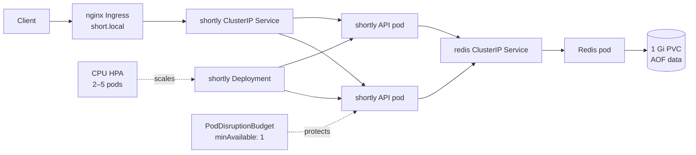

# shortly on minikube

This runbook builds four immutable image variants and deploys the FastAPI + Redis app into the `urlshortener` namespace. The app Deployment is scaled by an HPA, updated with zero-unavailable rolling releases, and exposed through the nginx Ingress add-on. Make targets use the dedicated minikube profile `shortly` by default so they do not reset or mutate an unrelated default `minikube` profile; override it with `PROFILE=...` if needed.

## Prerequisites

- Docker Desktop (or Docker Engine) running with at least 4 CPUs and 6 GiB memory available.
- `minikube`, `kubectl`, `curl`, `bash`, and Python 3 installed on the host. Python is used by the rollout probe to parse `/version` responses.
- The repo's Python 3.12 dependencies installed for lint/tests. `make install` creates `.venv`.
- Host networking configured as described under [Hostname access](#hostname-access).

Check the tools before starting:

```sh
docker info
minikube version
kubectl version --client
```

## First-time setup

Run the commands from the repository root. The cluster starts with the Docker driver, and image tags are kept distinct for local loading.

```sh
make k8s-up
make build-all
make load-all
ADMIN_TOKEN='choose-a-local-demo-token' make deploy
make status
make smoke
```

`ADMIN_TOKEN` is sent to Kubernetes as a Secret and is not stored in this repo. If omitted, the demo-only default is `demo-admin-token`. Set `IMAGE=ghcr.io/<user>/shortly-devops` when building/pushing under a registry name; local minikube runs default to `shortly`.

To use the port-forward fallback instead of the Ingress hostname:

```sh
make pf
make smoke BASE=http://localhost:8000
```

Leave `make pf` running in its terminal while smoke checks run.

For an Ingress-controller port-forward on a host where `short.local` cannot be mapped, use `kubectl -n ingress-nginx port-forward service/ingress-nginx-controller 8080:80` and run the scripts with `BASE=http://localhost:8080 HOST_HEADER=short.local`. `HOST_HEADER` is optional and only needed when the URL host differs from the Ingress rule host.

## Hostname access

The Ingress host is `short.local`.

- **Linux with the Docker driver:** add the minikube node address to `/etc/hosts`:

  ```sh
  echo "$(minikube -p shortly ip) short.local" | sudo tee -a /etc/hosts
  ```

- **macOS or Windows with the Docker driver:** run `minikube tunnel` in a separate terminal and keep it running. Map `127.0.0.1 short.local` in the hosts file. On macOS edit `/etc/hosts`; on Windows edit `C:\Windows\System32\drivers\etc\hosts` with an administrator editor.

The manifest uses nginx Ingress with a `Prefix` route on `/`. The ingress controller's `use-forwarded-headers` setting is enabled by `make k8s-up`. This preserves a supplied `X-Forwarded-For` value through the ingress so the app can apply per-client-IP rate limits. Only use this setting behind the local trusted ingress; in a public deployment, configure trusted proxy boundaries carefully.

## Architecture



The FastAPI pods have no local link state. Redis stores links, click counts, rate limits, recent links, and chaos configuration; its append-only data is persisted on the PVC.

## Demo runbook

### 1. Zero-downtime release

Run the probe in one terminal and start the rollout in another:

```sh
make probe
make good-release
```

Expected: the probe first reports `v1`, then `v2` as new pods serve traffic. On Ctrl-C, the summary shows **0 non-2xx or failed requests**. The Deployment uses `maxUnavailable: 0`, so old Ready pods continue serving while replacements become Ready.

### 2. Bad release: crash loop

```sh
make bad-release-crash
kubectl -n urlshortener get pods -o wide
make rollback
kubectl -n urlshortener rollout history deployment/shortly
```

Expected: the release command eventually exits non-zero after the rollout stalls; new `v2-bad-crash` pods enter `CrashLoopBackOff`, while old Ready pods continue serving. After rollback, the old ReplicaSet is active and the stuck pods terminate. The rollout has a 90-second progress deadline and the command waits up to 120 seconds.

### 3. Bad release: application errors

```sh
make bad-release-errors
curl -i -X POST "$BASE/api/shorten" -H 'Content-Type: application/json' -d '{"url":"https://example.com"}'
make rollback
kubectl -n urlshortener rollout history deployment/shortly
```

Expected: `v2-bad-errors` pods become Ready because `/healthz` and `/readyz` still pass, while approximately 40% of shorten/redirect requests return 500. This demo failure is visible in error-rate metrics (expanded in Phase 3), not in Kubernetes readiness. Run rollback after observing it.

### 4. Redis outage and recovery

```sh
make redis-down
kubectl -n urlshortener get pods -o wide
curl -i "$BASE/readyz"
curl -i "$BASE/healthz"
make redis-up
kubectl -n urlshortener rollout status deployment/shortly --timeout=120s
```

Expected: app pods become NotReady because `/readyz` cannot reach Redis; `/healthz` stays 200 for liveness, and the Ingress has no ready app endpoints so requests can return 503. Scaling Redis back to one replica restores readiness automatically. The PVC and its AOF data remain attached when the Redis Deployment is scaled to zero; deleting the namespace removes the PVC too.

### 5. HPA metrics

```sh
kubectl -n urlshortener describe hpa shortly
kubectl -n urlshortener top pods
```

Expected: the HPA reports a current CPU percentage against the 60% target, not `<unknown>`. If metrics are unavailable, wait for metrics-server to become Ready and retry.

### Verify forwarded client IP

Send a request through the Ingress with an explicit test address, then find it in the JSON access log:

```sh
curl -i -X POST "$BASE/api/shorten" \
  -H 'Content-Type: application/json' \
  -H 'X-Forwarded-For: 1.2.3.4' \
  -d '{"url":"https://example.com/xff-check"}'
kubectl -n urlshortener logs -l app.kubernetes.io/name=shortly,app.kubernetes.io/component=api \
  --since=1m --prefix | grep '"client_ip":"1.2.3.4"'
```

The app log entry should contain `"client_ip":"1.2.3.4"`.

### Verify container security settings

```sh
kubectl -n urlshortener get pods -l app.kubernetes.io/component=api \
  -o jsonpath='{range .items[*]}{.metadata.name}{" runAsUser="}{.spec.containers[0].securityContext.runAsUser}{" readOnlyRootFilesystem="}{.spec.containers[0].securityContext.readOnlyRootFilesystem}{"\n"}{end}'
```

Expected for every app pod: `runAsUser=10001` and `readOnlyRootFilesystem=true`.

## Troubleshooting

- **`ImagePullBackOff`:** the tag is missing inside minikube. Run `make load-all` after `make build-all`; the pod uses `IfNotPresent` and does not pull a registry image.
- **`short.local` does not resolve:** check the hosts-file entry and that it points to `$(minikube ip)` on Linux or `127.0.0.1` on macOS/Windows.
- **macOS/Windows Ingress is unreachable:** keep `minikube tunnel` running in a separate terminal, or use `make pf` and set `BASE=http://localhost:8000` for smoke/probe scripts.
- **Ingress controller is not Ready:** inspect `kubectl -n ingress-nginx get pods` and `kubectl -n ingress-nginx describe deployment ingress-nginx-controller`; rerun `make k8s-up` after the addon is healthy.
- **HPA metrics show `<unknown>`:** wait for `kubectl -n kube-system get pods -l k8s-app=metrics-server` to show Ready, then inspect `kubectl top nodes` and `kubectl top pods -n urlshortener`.
- **App pods are NotReady:** check Redis with `kubectl -n urlshortener get pods,svc,pvc` and app logs with `make logs`; `/readyz` requires Redis while `/healthz` deliberately does not.
- **Secret not found:** run `ADMIN_TOKEN='your-token' make secret`, then restart rollout if the deployment was already created.

## Design decisions

- **Namespace and labels:** every Kubernetes object is in `urlshortener`, and carries the `app.kubernetes.io/name`, `app.kubernetes.io/part-of`, and component labels. App objects use component `api`; Redis objects use `redis`.
- **Dedicated cluster profile:** Make targets default to a separate minikube profile named `shortly`, preserving any pre-existing `minikube` profile and its data. `PROFILE` is overridable for teams that manage their own profile.
- **Image contents:** a multi-stage build installs only runtime requirements to a prefix, then copies that prefix and `app/` into a fresh Python 3.12 slim image. No test tools, source metadata, or local build caches enter the final stage.
- **Release identity:** `APP_VERSION` and `BAD_RELEASE_MODE` are image environment values. They are not in the ConfigMap or Deployment env so a rollout tag controls its own behavior.
- **Replica ownership:** the app Deployment omits `spec.replicas`; the HPA owns the steady-state count, with a minimum of two pods and CPU requests for utilization calculation.
- **Zero-unavailable rollout:** `maxUnavailable: 0`, one surge pod, readiness probes, and a five-second readiness delay let old Ready pods keep serving while a replacement starts. A crash-looping new pod cannot replace an old Ready pod.
- **Redis persistence:** Redis is a single Recreate Deployment with AOF on a 1 Gi ReadWriteOnce PVC. This is suitable for the local demo, not a highly available production Redis topology.
- **Secret handling:** `shortly-secrets` is generated by `make secret` and excluded from Kustomize resources. `secret.example.yaml` only contains a documented demo placeholder; never put a real token in that file or commit generated Secret YAML.
- **Ingress forwarded headers:** the local ingress controller is configured to preserve the provided forwarded client IP so the app's `TRUST_XFF=true` rate limiting can be demonstrated. This assumes the ingress is trusted and must not be copied blindly to an untrusted edge.
- **Health behavior:** Kubernetes startup and liveness use `/healthz`, which does not depend on Redis. Readiness uses `/readyz`, removing a pod from service during a Redis outage without restarting it.
- **HPA scale-down:** the 60-second stabilization window is intentionally short for a quick demo; a production service may use a longer window and custom scale policies.
- **Local registry behavior:** images use unique, non-`latest` tags and `IfNotPresent`; `make load-all` explicitly loads all four variants into minikube. `IMAGE` is overridable for later registry-based CI.
