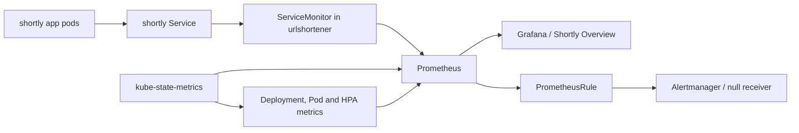

# shortly monitoring

This adds the Prometheus Community `kube-prometheus-stack` Helm chart, the app's Prometheus `ServiceMonitor`, six Shortly alert rules, and a Grafana dashboard provisioned from a labeled ConfigMap. The chart is pinned to **91.8.2** (chart app version `v0.94.1`). Grafana and Prometheus are exposed with port-forward only; no additional Ingress or host mapping is needed.

## Architecture



Prometheus scrapes the app's `/metrics` endpoint and kube-state-metrics. Grafana discovers dashboard ConfigMaps across namespaces by the `grafana_dashboard="1"` label. Prometheus evaluates the Shortly rules and sends firing state to Alertmanager; the configured `null` receiver keeps this local demo notification-free.

## Prerequisites and first-time setup

Start from the repository root. Phase 2's `shortly` Minikube profile and app in `urlshortener` must already be running. Docker Desktop should give Minikube about 6 GiB and four CPUs. Install the Helm CLI if it is not already present. The `monitoring-up` target adds/updates the Prometheus Community repository, installs the pinned chart, then server-side applies the custom resources.

```sh
make k8s-up
make build-all
make load-all
ADMIN_TOKEN='demo-admin-token' make deploy
make monitoring-up
make monitoring-status
make traffic DURATION=120
make check-dashboard
make alerts
```

`CHART_VERSION` defaults to `91.8.2`; update it intentionally after checking a stable release with `helm repo update` and `helm search repo prometheus-community/kube-prometheus-stack --versions`. `MON_NS`, `PROM_SVC`, and `GRAFANA_SVC` are Make variables if the Helm release is customized. `monitoring/` has no global namespace transformer: the ServiceMonitor is explicitly in `urlshortener`, while the PrometheusRule and generated dashboard ConfigMap are explicitly in `monitoring`.

## Accessing the UIs

Run each target in its own terminal and keep it running:

```sh
make grafana       # http://localhost:3000, admin / demo-grafana-pass
make prometheus    # http://localhost:9090
make alertmanager  # http://localhost:9093
```

The Grafana password is a **local demo credential only**. Grafana has no PVC; its dashboards and datasources are provisioned. To verify the dashboard through Grafana's API after `make grafana` is running:

```sh
curl -fsS -u admin:demo-grafana-pass 'http://localhost:3000/api/search?query=Shortly'
```

The result should include `Shortly / Overview` without a manual import. Repeat the API check after `make monitoring-down monitoring-up` to confirm it is provisioned again.

## PromQL cheat sheet

Dashboard Prometheus datasource UID is `prometheus`, read from the live Grafana API. The app target carries `namespace`, `pod`, `service`, and `job`; the actual job value is **`shortly`**. Use these common selectors throughout:

- `APP = job="shortly", namespace="urlshortener"`
- `REAL = handler!~"/healthz|/readyz"` (removes Kubernetes probe traffic from user-request rates, availability, and latency)

| Panel | Query | What it shows |
|---|---|---|
| Pods UP | `sum(up{APP})` | Healthy app scrape targets, one per Ready replica. |
| Availability (5m) | `100 * (1 - (5xx rate / total rate))` over `[5m]`, with zero-safe guards | Percentage of real requests without a 5xx. |
| Request rate | `sum(rate(http_requests_total{APP,REAL}[1m]))` | Real requests per second. |
| Error rate (5xx %) | `100 * sum(rate(http_requests_total{APP,REAL,status=~"5.."}[1m])) / clamp_min(sum(rate(http_requests_total{APP,REAL}[1m])),1e-9) or vector(0)` | Zero-safe 5xx percentage. |
| p95 latency | `histogram_quantile(0.95,sum by (le)(rate(http_request_duration_seconds_bucket{APP,REAL}[1m])))` | p95 real-request latency. The live `/metrics` check confirmed this handler-labeled histogram includes the `le="0.5"` bucket. |
| Redis up | `min(shortly_redis_up{APP}) or vector(0)` | Redis reachability gauge; 0 maps to DOWN, 1 to UP. |
| Running versions | `count by (version)(shortly_build_info{APP})` | App pod count by image-provided release version. |
| Request rate by status | `sum by (status)(rate(http_requests_total{APP,REAL}[1m]))` | Stacked requests per second by exact HTTP status. |
| 4xx rate | `sum(rate(http_requests_total{APP,REAL,status=~"4.."}[1m]))` | Client and validation errors per second. |
| 5xx rate | `sum(rate(http_requests_total{APP,REAL,status=~"5.."}[1m]))` | Server errors per second; empty is normal when healthy. |
| Latency p50/p95/p99 | `histogram_quantile(0.50|0.95|0.99,sum by (le)(rate(http_request_duration_seconds_bucket{APP,REAL}[1m])))` | Real-request latency percentiles and a 0.5-second threshold. |
| 5xx percentage | Same zero-safe ratio as Error rate (5xx %) | Error percentage over time with a 5% threshold. |
| Request rate by handler | `sum by (handler)(rate(http_requests_total{APP,REAL}[1m]))` | Normalized route templates such as `/{code}`, not raw short codes. |
| Request rate by pod | `sum by (pod)(rate(http_requests_total{APP,REAL}[1m]))` | Load distribution across app replicas. |
| Pod uptime | `time() - process_start_time_seconds{APP,pod!=""}` | Seconds since each app process started. |
| Pod restarts | `sum by (pod)(increase(kube_pod_container_status_restarts_total{namespace="urlshortener",pod=~"shortly-.*",container="shortly"}[5m]))` | App container restart increases; an empty result is normal with no restarts. |
| Deployment and HPA replicas | `kube_deployment_status_replicas_available`, `kube_deployment_spec_replicas`, `kube_horizontalpodautoscaler_status_current_replicas`, `kube_horizontalpodautoscaler_status_desired_replicas` filtered to `urlshortener/shortly` | Available/desired Deployment and current/desired HPA counts. These kube-state-metrics names were queried from the installed Prometheus. |
| CPU per app pod | `sum by (pod)(rate(container_cpu_usage_seconds_total{namespace="urlshortener",pod=~"shortly-.*",cpu="total"}[1m]))` plus `kube_pod_container_resource_requests{namespace="urlshortener",pod=~"shortly-.*",container="shortly",resource="cpu",unit="core"}` | Pod CPU usage and the 0.1-core request. The Minikube cAdvisor series has namespace/pod labels but no `container` label, so the usage selector intentionally omits it. |
| Business rates/min | `sum(rate(shortly_links_created_total{APP}[1m]))*60` (also redirects, rate limited, and blocked counters) | Links created, successful redirects, rate-limited requests, and blocked destination attempts per minute. |

The dashboard annotation query is `ALERTS{alertname=~"Shortly.*",alertstate="firing"}` and marks firing Shortly alerts on the time-series panels.

## Alert rules

All custom rules are evaluated every 15 seconds. Demo `for:` periods are intentionally short; in production, use longer windows to avoid flapping and allow for transient recovery.

| Alert | Condition and `for` | Demo scenario | Resolve |
|---|---|---|---|
| `ShortlyHighErrorRate` | Real 5xx ratio >5% and >0.5 requests/s for 1m | Chaos errors or `make bad-release-errors` | Reset chaos with `DELETE /admin/chaos` or run `make rollback`. |
| `ShortlyHighLatencyP95` | Real p95 >0.5s with >0.5 requests/s for 1m | Chaos latency | Reset chaos with `DELETE /admin/chaos`. |
| `ShortlyPodsNotReady` | `kube_deployment_status_replicas_unavailable > 0` for 1m | Redis down; may also appear during a prolonged crash rollout | `make redis-up` or `make rollback`. |
| `ShortlyPodCrashLooping` | App container restart increase during 5m for 1m | `make bad-release-crash` | `make rollback`. |
| `ShortlyRedisDown` | Redis gauge is 0 or the app metrics target disappears for 30s | `make redis-down` | `make redis-up`. |
| `ShortlyTargetDown` | An app scrape target is down or absent for 1m | App endpoint/ServiceMonitor outage | Restore Ready app endpoints and inspect `make monitoring-status`. |

Every alert has `severity` and `app: shortly` labels plus a summary and resolution-oriented description. The traffic guards prevent idle intervals from causing rate/latency alerts.

## Demo scenarios and dashboard panels

Run `make traffic DURATION=120` in a separate terminal while triggering a scenario. The throwaway generator creates and redirects links, then samples 404, 409, 422, and 403 responses; one short same-IP burst produces 429s. Ordinary requests use rotating `X-Forwarded-For` addresses so per-IP limits do not dominate. It is only for exercising panels; Phase 4 Locust tests will cover realistic user behavior.

For a host without `short.local` configured, forward the Ingress controller and pass the expected host to both scripts:

```sh
kubectl -n ingress-nginx port-forward service/ingress-nginx-controller 8080:80
BASE=http://localhost:8080 HOST_HEADER=short.local make traffic DURATION=120
```

| Scenario | Trigger and reset | Panels and expected alert |
|---|---|---|
| Chaos latency | `curl -X POST "$BASE/admin/chaos" -H "X-Admin-Token: $ADMIN_TOKEN" -H "Content-Type: application/json" -d '{"latency_ms":800,"error_pct":0}'`; reset with `curl -X DELETE "$BASE/admin/chaos" -H "X-Admin-Token: $ADMIN_TOKEN"` | p95 latency and latency percentiles rise; `ShortlyHighLatencyP95` fires. |
| Chaos errors | POST `{"latency_ms":0,"error_pct":30}` to `/admin/chaos`; reset with DELETE | 5xx rate and percentage rise; `ShortlyHighErrorRate` fires. |
| Errors release | `make bad-release-errors`; reset with `make rollback` | 5xx panels rise while readiness stays green; `ShortlyHighErrorRate` fires. |
| Crash release | `make bad-release-crash`; reset with `make rollback` after its rollout deadline | Pod restarts rise; `ShortlyPodCrashLooping` fires; `ShortlyPodsNotReady` may fire if enough replicas are unavailable. |
| Redis outage | `make redis-down`; restore with `make redis-up` | Redis up falls, pods become NotReady; `ShortlyRedisDown` and `ShortlyPodsNotReady` fire. |
| Rolling update | Start `make probe` and run `make good-release` in another terminal | Running versions briefly shows both tags; probe should show no failed requests. |

After each reset, use `make alerts` until the alert resolves. Finish with the `v1` baseline (`make rollback` as needed), `make smoke`, and `make alerts`.

## Troubleshooting

- **App target not discovered:** check the `ServiceMonitor` is in `urlshortener`, its namespace selector names that namespace, and the `shortly` Service has `app.kubernetes.io/name=shortly`, `app.kubernetes.io/component=api`, and a port named `http`. `make monitoring-status` shows target health.
- **Dashboard not appearing:** check the generated ConfigMap in `monitoring` has `grafana_dashboard="1"`, sidecar dashboards search `ALL`, and Grafana sidecar logs. Query `/api/search?query=Shortly` after a short provisioning delay.
- **CRD or large ConfigMap annotation errors:** use `make monitoring-apply`; it uses `kubectl apply --server-side -k monitoring/`.
- **Prometheus OOMKilled:** inspect `kubectl -n monitoring describe pod` and raise the Prometheus memory limit if the demo workload has grown. The default is 1 GiB.
- **Histogram panels empty:** verify `http_request_duration_seconds_bucket` and the `handler` labels at the running app's `/metrics`; this implementation uses the labeled histogram, not the high-resolution unlabeled histogram.
- **Datasource UID mismatch:** fetch Grafana's `/api/datasources` endpoint; the dashboard references the stack's actual default UID `prometheus`.
- **CPU panel empty:** inspect `container_cpu_usage_seconds_total` in Prometheus. Minikube cAdvisor exposes per-pod series without a container label; the dashboard uses `namespace`, `pod`, and `cpu="total"`.
- **HPA panel missing:** confirm kube-state-metrics is Running and query the `kube_horizontalpodautoscaler_status_*` series with `make promq`.

## Design decisions

- **Chart pin:** `91.8.2` was selected from the updated Prometheus Community repository search and is pinned in Makefile for repeatable installs.
- **Selector discovery:** all four Prometheus monitor/rule selectors disable Helm-release-only filtering so the app monitor and separately applied rules are selected across namespaces.
- **Scrape cadence:** Prometheus scrapes general stack targets every 15 seconds; the app monitor uses 10 seconds so rollout and demo changes appear promptly without a high scrape load.
- **Probe exclusion:** `/healthz` and `/readyz` run continually from Kubernetes. Excluding them from user ratios and latency keeps synthetic probe traffic from diluting errors or improving apparent latency.
- **Traffic guards:** error and latency alerts require sustained real-request traffic so an idle service does not divide by zero or flap on a handful of samples.
- **Short demo windows:** alert `for:` periods of 30 seconds to 1 minute make the scenario practical to observe. Production rules should use longer windows.
- **Minikube default alert:** the chart's `PrometheusMissingRuleEvaluations` warning fired intermittently during the lightweight single-node demo despite rule groups completing in milliseconds. It is disabled through the chart's supported `defaultRules.disabled` setting so the baseline alert view only shows actionable app alerts and the always-firing `Watchdog`.
- **Minikube cAdvisor labels:** the live cAdvisor series does not include a `container` label. The CPU query groups by app pod and pairs usage with the confirmed kube-state-metrics CPU request series.
- **Storage and memory:** Prometheus keeps two days of data, capped at 1 GB, on a 2 GiB default-class PVC. Grafana is stateless; single-replica Alertmanager and kube-state-metrics use small resource limits. Grafana's requested 256 MiB limit caused OOMKilled restarts with the chart 91.8.2 Grafana 13.2.3 image, so the configured limit is 384 MiB. Node exporter and Minikube-incompatible control-plane scrapes are disabled.
- **Logging stretch:** Loki and a collector are skipped to keep this local stack small and focused. Use the existing `make logs` target to inspect the app's JSON logs with kubectl.
- **Credentials and notifications:** Grafana's `demo-grafana-pass` and the Alertmanager `null` receiver are local demo choices, not production credentials or notification routing.
